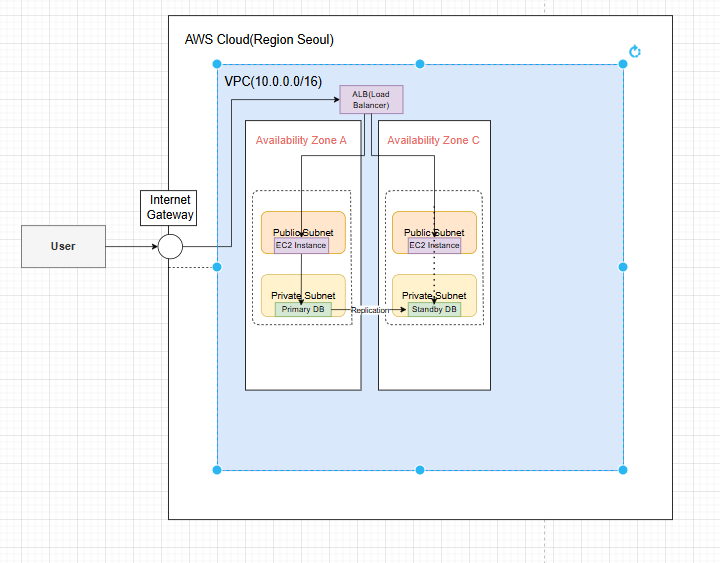

# aws-high-availability-petclinic
AWS Multi-AZ High Availability Architecture for Spring PetClinic
# 🐾 AWS High-Availability Web Architecture (Spring PetClinic)

이 프로젝트는 **AWS 클라우드 환경에서 고가용성(High Availability)과 장애 허용(Fault Tolerance)**을 보장하는 3계층(3-Tier) 인프라 아키텍처를 설계하고 구축한 사례입니다.

## 🏗 Architecture Diagram

> **Note:** 위 이미지가 보이지 않는다면 파일명이 `aws-architecture.png`로 저장되어 있는지 확인해 주세요.

---

## 🛠 Tech Stack
- **Cloud:** AWS (VPC, EC2, ALB, ASG, RDS)
- **Networking:** Public/Private Subnets, Internet Gateway, Security Groups
- **Database:** MySQL (Multi-AZ RDS)
- **Application:** Spring Boot PetClinic (Java)

## 🚀 Key Infrastructure Features

### 1. Multi-AZ High Availability
- **Availability Zones:** `ap-northeast-2a`와 `ap-northeast-2c` 두 개의 가용 영역을 활용하여 데이터센터 레벨의 장애에 대비했습니다.
- **ALB (Application Load Balancer):** 사용자 트래픽을 각 AZ의 서버로 분산하여 로드밸런싱을 수행합니다.

### 2. Auto Scaling & Self-Healing
- **Auto Scaling Group (ASG):** 인스턴스의 상태를 실시간으로 감시하며, 장애 발생 시 자동으로 인스턴스를 교체(Self-healing)합니다.
- **Capacity:** Desired: 2 / Min: 2 / Max: 4 설정을 통해 유동적인 트래픽 대응이 가능합니다.

### 3. Advanced Security & Data Reliability
- **Subnet Isolation:** 웹 서버(EC2)는 Public Subnet에, 데이터베이스(RDS)는 외부 접근이 불가능한 Private Subnet에 배치하여 보안을 강화했습니다.
- **RDS Multi-AZ Failover:** Primary DB 장애 시 60~120초 내에 Standby DB로 자동 페일오버되어 데이터 연속성을 유지합니다.

## 🧪 Experiments & Recovery Test (Evidence)
- **Scenario:** `ap-northeast-2a` 구역의 EC2 인스턴스 1대를 강제로 종료(Terminate).
- **Result:** 1. ALB가 해당 인스턴스의 장애를 감지하고 트래픽 전송 중단.
  2. Auto Scaling Group이 부족한 인스턴스를 인지하고 `ap-northeast-2c` 구역에 새로운 서버 자동 생성.
  3. **약 2분 만에 전체 시스템 복구 및 서비스 정상 유지 확인.**

---
*본 프로젝트는 학습 목적으로 [Spring PetClinic] 오픈소스를 활용하여 인프라를 구성하였습니다.*
